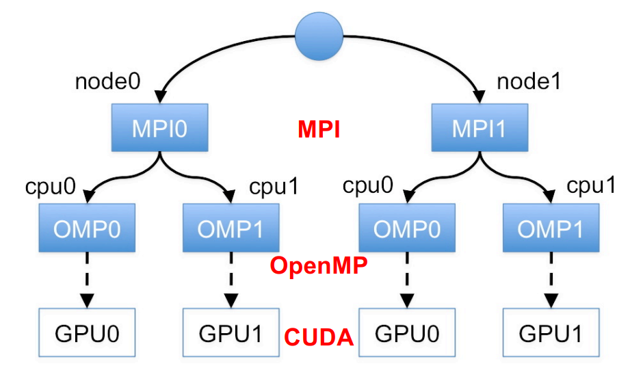
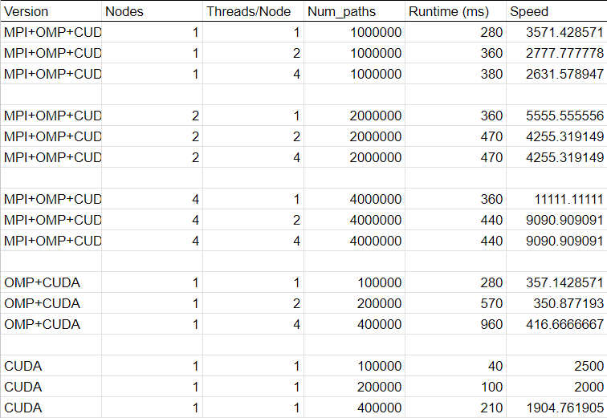

# CSCI596_Option-Pricing

## How to run:

#### Single CPU, Single GPU running on multiple Cuda threads and a single CPU thread:
```console
foo@bar:~$ make main
foo@bar:~$ sbatch main.sl
```

#### Multiple CPU, Multiple GPU running on multiple Cuda threads and multiple CPU threads:
```console
foo@bar:~$ make main_omp
foo@bar:~$ sbatch main_omp.sl
```
#### Multiple Node, Multiple CPUs, Multiple GPUs running on multiple Cuda threads and multiple CPU threads
(Not finished yet)
## Brief background

This project simulates barrier options, where the pay-off not only depends on the underlying asset's price at maturity but also on whether the underlying hits a price known as the barrier.

We currently use a down-and-out kind of call option, although we are adding more options to run soon.
We have set the rebate price as 0, but we are also working on adding the option to allow a different rebate price.

## Presentation
[Link](https://docs.google.com/presentation/d/1jKo4DxYR8iUAGKAsCCW4L0UDvdvlTYFz5IpUdjG1vR8/edit#slide=id.g2628c323073_0_54)


## Methodology

### Architecture of the system we run this on:
We run our program on the CARC High-Performance computing cluster.
The architecture looks something like this:


<p>
The computation is divided between nodes, and each node runs a process.
Each node interacts with each other using the Message Passing Interface (MPI)
<p>
Each node has multiple CPU Cores in it, and these cores can run multiple threads for each node process. These threads use OpenMP for interaction and parallelization of threads
<p>
Each node also has accelerated GPU units associated with it where each unit can run multiple CUDA threads.


### How the code works:

We use the Geometric Brownian Motion to simulate the underlying price, and the discretized Euler method version comes down to this:

$$ S_t = S_{t-1}\ +\  \mu S_{t-1} \Delta t\+ \ \sigma  S_{n-1}\Delta W_t  $$

$S_t$: The price of the underlying at time t <br>
$\mu$ : The expected return <br>
$\sigma$ : The expected volatility<br>
$\Delta t$: The time difference between each iteration <br>
$\Delta W_t$: Random number drawn from a distribution with mean 0 and variance $\Delta t$ (Brownian motion component) <br>
<br>

The code generates an array of random elements $\Delta W_t$ and simulates the price motion according to it. 
We have four versions of the code:
<ol>
<li> <p>Simple single, threaded version
<li> <p>Single CPU, Single GPU running on multiple Cuda threads and a single CPU thread
<li><p> Multiple CPU, Multiple GPU running on multiple Cuda threads and multiple CPU threads
<br> Each CPU runs a single CPU thread. Here, we allocate a GPU to every CPU and reduce the result from multiple CUDA threads running on a Single GPU performed on a Single CPU thread.  
<li> <p> Multiple Node, Multiple CPUs, Multiple GPUs running on multiple Cuda threads and multiple CPU threads<br>
Each node runs a version of Multiple CPUs, Multiple GPUs running on multiple Cuda threads, and multiple CPU threads
</ol>

## Charts:

### CUDA Scaling:
Single CUDA thread scaling with different sizes of input

.png>)

### OMP + CUDA
OMP threads + CUDA scaling; Note that the input size is scaled according to the number of threads, i.e. for 1 thread, input size = 100000 Paths, for 2, it is 200000 and for 4 it is 400000

 .png>)

### MPI + OMP + CUDA
MPI + OMP + CUDA scaling; Input is scaled in the same way as in OMP + CUDA

When run on a single node:

.png>)

When run on 2 nodes:

.png>)

When run on 4 nodes:

.png>)

### On larger input sizes
We then ran the same experiments on larger input. To not overload this README we just post the readings here:



## References

1. "Monte Carlo Simulations In CUDA - Barrier Option Pricing",  QuantStart, [Link](https://www.quantstart.com/articles/Monte-Carlo-Simulations-In-CUDA-Barrier-Option-Pricing/) <br>
